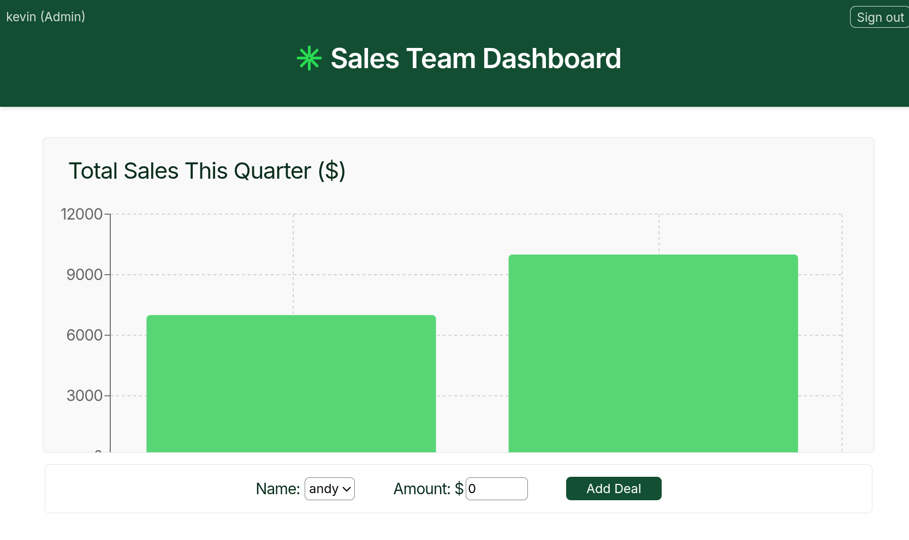
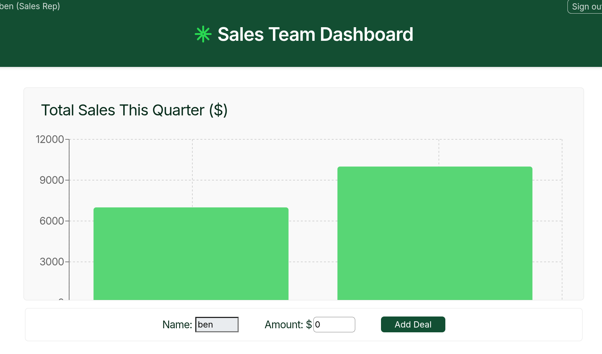
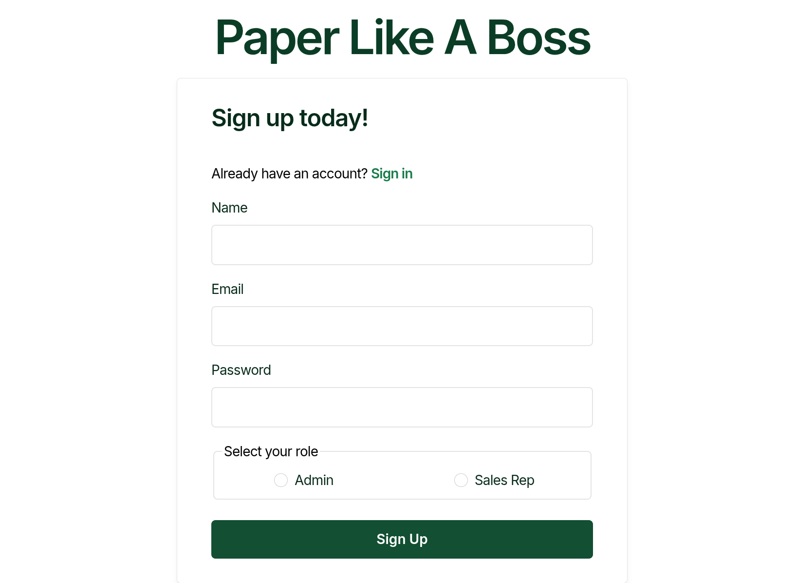
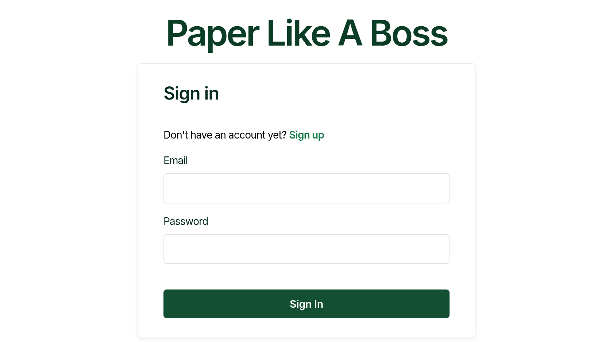

# Sales Dashboard


A lightweight sales team dashboard that authenticates users, visualizes total sales per rep, and lets admins or reps add new deals in real time. Built to showcase clean React architecture, Supabase integration, and a polished, accessible UI.

## Table of Contents
- [Project Overview](#project-overview)
- [Key Features](#key-features)
- [Tech Stack](#tech-stack)
- [Architecture Overview](#architecture-overview)
- [What I Implemented](#what-i-implemented)
- [What I Learned / Skills Demonstrated](#what-i-learned--skills-demonstrated)
- [Screenshots](#screenshots)
- [How to Run Locally](#how-to-run-locally)


## Project Overview
This project provides a simple, recruiter-friendly example of a real-world dashboard: secure sign-in, protected routes, real-time data updates, and a visual KPI view. The goal is clarity and maintainability, not just UI polish.

## Key Features
- Secure authentication with Supabase (sign up, sign in, sign out)
- Protected dashboard route that redirects unauthenticated users
- Real-time chart updates via Supabase `postgres_changes` channel
- Role-aware deal entry form (rep vs admin)
- Accessible, semantic forms and feedback states

## Tech Stack
- **Frontend:** React 19, TypeScript, Vite
- **Routing:** React Router
- **Data & Auth:** Supabase JS
- **Charts:** Recharts
- **Tooling:** ESLint, TypeScript project references

## Architecture Overview
- `src/router.tsx` defines routes, lazy-loads the dashboard, and protects private views.
- `src/context/AuthContext.tsx` centralizes auth session state and user profiles.
- `src/routes/Dashboard.tsx` fetches and subscribes to sales metrics.
- `src/components/` contains reusable UI (forms, header, protected route, chart).
- `src/supabase-client.ts` wraps Supabase configuration.

## What I Implemented
- Authentication flow (sign up/in/out) and session-aware routing
- Role-aware deal submission form with validation
- Real-time sales metrics and bar chart visualization
- Error handling and accessible UI states

## What I Learned / Skills Demonstrated
- Building auth + session flows with Supabase in React
- Real-time updates using database change subscriptions
- Structuring a React app with context and route protection
- Data visualization basics with Recharts
- Writing accessible, validation-friendly forms

## Screenshots
> Add your own images in `docs/screenshots/` and update paths below.

- Dashboard view

  
  

- Auth screen

  
  


## How to Run Locally
1. Install dependencies:

```bash
npm install
```

2. Create a `.env` file at the project root:

```bash
VITE_SUPABASE_URL=your_supabase_url
VITE_SUPABASE_KEY=your_supabase_anon_key
```

3. Start the dev server:

```bash
npm run dev
```

> Note: This app expects Supabase tables such as `user_profiles` (id, name, account_type) and `sales_deals` (user_id, value). Adjust the schema as needed for your project.

